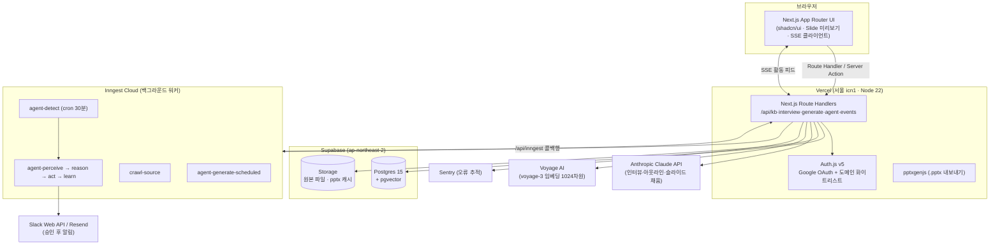

# Mind5 (DocMind Agent) — 개발 산출물 문서

> AI Agent Hack 2026 출품작 · 펜타시큐리티 디자인팀
> 제출용 본문(1–5장) + 기술 부록(A–D) 구조. 상세 설계 이력은 [IMPLEMENTATION_PLAN.md](IMPLEMENTATION_PLAN.md) 참조.

---

## 1. 제품 개요

**Mind5** 는 사내 URL·파일을 학습한 AI 가 5번의 질문만으로 회사 브랜드 PPT 를 자동 생성하고, 학습한 소스의 변경을 자율적으로 감지해 이미 발행된 문서를 갱신·알림하는 **문서 에이전트**다.

| 항목 | 내용 |
|---|---|
| 해결하는 문제 | 제안서·소개서 등 반복 문서 작성에 들어가는 시간, 그리고 "소스가 바뀌었는데 문서는 옛날 그대로"인 문서 부패(document rot) |
| 핵심 가치 | ① 5문답 → 30초 내 브랜드 PPT, ② 사람이 시키지 않아도 변경을 감지·갱신하는 자율 루프, ③ 발행은 항상 사람이 승인 (human-in-the-loop) |
| 배포 URL | https://penta-mind5.vercel.app (Google OAuth, `pentasecurity.com` 도메인 한정) |
| 표기명 | UI 는 "Mind5", 내부 코드·식별자는 "DocMind" |

---

## 2. 사용 플로우

### 2.1 Mode A — 인터뷰 기반 PPT 생성 (수동·대화형)

```
로그인(Google OAuth) → 홈: 6종 문서 카드(영업/기획/사업/기술/회의/마케팅)
  → 카드 클릭 → 5문답 인터뷰
       1) 독자        : 이 문서를 읽을 사람은?
       2) 콜투액션    : 읽고 나서 무엇을 하길 원하나?
       3) 예상 반론   : 어떤 반대에 부딪힐까?
       4) 핵심 메시지 : 한 줄 핵심 주장
       5) 분량·보안   : 페이지 수 + 보안 레벨(Level 1~5)
  → 매 단계 KB 에서 관련 사내 자료를 자동 매칭("매칭 인사이트" 카드)
  → 생성: 아젠다↔본문 정합이 보장된 슬라이드 덱
  → 브라우저 미리보기(React 렌더) / .pptx 다운로드(브랜드 토큰 적용)
  → 문서함에 버전과 함께 보관
```

### 2.2 Mode B — 자율 갱신 루프 (에이전트)

```
KB 소스 변경 (URL 내용 변경 or 파일 교체)
  → [감지] 30분 cron 또는 수동 트리거가 content_hash 비교 (5% 이상 변경 시 발화)
  → [인식] 변경 전후 diff 분석 (무엇이 어떻게 바뀌었나)
  → [판단] 이 소스를 참조하는 발행 문서들의 영향도 평가
  → [행동] 영향 문서의 신규 draft 버전 생성 + 승인 큐 등록
  → [학습] 변경 패턴을 임베딩으로 축적
  → 대시보드 활동 피드에 5단계 실시간 표시(SSE) → 우측 승인 카드
  → 사용자가 "발행 승인" → 그때서야 Slack(#docmind-demo) + Email 알림 발송
```

발송은 항상 승인 후에만 일어난다(자율 outbound 금지 불변식).

### 2.3 Mode C — 스케줄 생성

설정한 cron 주기에 맞춰 동일한 인터뷰 답변 세트로 문서를 자동 생성한다(예: 주간 리포트).

### 2.4 KB(지식 베이스) 관리

- URL 등록: 크롤링 → 본문 추출 → 청크 → 임베딩 → `ready`
- 파일 업로드: PDF / PPTX / DOCX / XLSX → 텍스트 추출 → 동일 파이프라인
- 소스 수정(내용 교체)·삭제, 수동 "지금 감지" 트리거, 카드/상세에서 원문 페이지 열기
- **최신 지식 및 동향 자동 수집**: 스위치 ON 동안 AI 가 KB 주제를 기반으로 웹을 검색(Anthropic web search 도구)해 관련 최신 자료를 자동 등록. 켜는 즉시 1회 + 매일 현지 0시·12시(워크스페이스별 시간대) 자동 실행. 크롤 성공분만 등록(실패 카드 없음, 회당 최대 20건), 30일 자동 정리, 별도 탭에 카드로 표시

---

## 3. 시스템 아키텍처



- 데이터 쿼리는 Drizzle + postgres-js 직결만 사용하고, supabase-js 는 Storage 전용 (Data API 미사용 — 2026-10-30 정책 변경 무영향).
- 모든 DB 쿼리는 `workspace_id` 로 격리.
- 미리보기(React)와 다운로드(pptxgenjs)는 **같은 디자인 토큰·레이아웃 정의를 import** 해 시각 정합을 보장한다.

---

## 4. 기술 스택

| 계층 | 선택 | 선택 이유 (요약) |
|---|---|---|
| 프론트엔드 | Next.js 16 (App Router) + TypeScript + Tailwind v4 + shadcn/ui | RSC 로 서버 데이터 결합, 단일 레포로 풀스택 |
| 인증 | Auth.js v5 + Google OAuth | `profile.hd === 'pentasecurity.com'` 검증으로 사내 한정 |
| DB / Storage | Supabase (Postgres 15 + pgvector + Storage) | 벡터 검색·관계형·파일을 한 서비스로, 무료 티어로 데모 충분 |
| ORM | Drizzle (postgres-js, `prepare: false`) | 타입 안전 + Supabase pooler 호환 |
| LLM | `@anthropic-ai/sdk` 직접 호출 — Claude Sonnet 4.6 기본, Opus 보조 | 프레임워크 없이 prompt caching·tool use 직접 제어 |
| 임베딩 | Voyage AI `voyage-3` (1024차원) | 한국어 품질 대비 비용, fetch 직접 호출(SDK ESM 빌드 결함 우회) |
| 백그라운드 | Inngest | 에이전트 5단계 루프와 함수가 1:1 매핑, step 단위 재시도 |
| 실시간 | Server-Sent Events | 단방향 피드에 WebSocket 불필요 |
| PPT | 자체 React `<Deck>` 미리보기 + pptxgenjs 다운로드 | Slide IR(중간 표현) 하나를 두 렌더러가 공유 |
| 디자인 토큰 | Figma → `tokens.ppt.json` (단일 출처) | 슬라이드 코드에 hex·좌표 직접 기입 금지 |
| 알림 | Slack Web API + Resend | 승인 후 발송 불변식 |
| 배포 | Vercel + Supabase + Inngest Cloud | 서버리스, 함수 리전 서울(icn1) 고정으로 DB 정합 |
| 옵저버빌리티 | Sentry (`sendDefaultPii: false`) | PII 미수집 원칙 |

---

## 5. 사용 서비스·인프라

| 서비스 | 역할 | 운영 메모 |
|---|---|---|
| **Vercel** | Next.js 호스팅 (서버리스 함수) | Node 22 고정, 리전 `icn1`(서울). 서버리스 비호환 라이브러리는 대체 적용(jsdom→linkedom, pdf-parse→unpdf) |
| **Supabase** | Postgres(+pgvector) · Storage 2버킷(소스 원본 / pptx 캐시) | 앱 런타임은 pooler URL + `prepare:false`. Storage 키는 서버에서 `${workspaceId}/${ulid()}/${safeName}` 강제 |
| **Inngest Cloud** | 백그라운드 잡 (크롤, 에이전트 5단계, 스케줄 생성, 동향 수집) | Vercel 통합으로 배포 시 자동 sync. 함수: `crawl-source`, `agent-detect`(cron `*/30`), `agent-perceive/reason/act/learn`, `agent-generate-scheduled`, `trend-scan`(매시 cron + 시간대 게이트) |
| **Anthropic Claude API** | 인터뷰 질문 생성, 문서 플랜(`propose_plan`), 슬라이드 채움, diff 분석, **웹 검색**(최신 동향 수집 — web search 서버 도구) | 시스템 프롬프트·KB 컨텍스트에 prompt caching (`cache_control: ephemeral`) |
| **Voyage AI** | 쿼리·청크 임베딩 (voyage-3, 1024차원) | 무료 티어 3 RPM 주의 — 앱이 쿼리 캐시(LRU 256) + 배치 호출로 생성당 호출 17→4회 절감 |
| **Slack Web API** | 발행 승인 알림 (#docmind-demo) | 승인 시점에만 발송, 버튼 링크는 `NEXT_PUBLIC_APP_URL` 기반 |
| **Resend** | 발행 알림 이메일 (워크스페이스 멤버) | Slack 과 동일한 승인 후 발송 |
| **Sentry** | 서버·클라이언트 오류 추적 | PII 전송 비활성 (`sendDefaultPii: false` 3개 설정 파일 강제) |

---
---

# 부록 (기술 상세)

## A. 핵심 동작 원리

### A.1 KB 파이프라인 (URL/파일 → 검색 가능한 지식)

```
등록 → Inngest crawl-source
  URL : fetch → linkedom 으로 DOM 구성 → Mozilla Readability 본문 추출
  PDF : unpdf (서버리스 호환 pdfjs 내장)
  DOCX: mammoth · PPTX/XLSX: 전용 파서
→ 청크 분할(토큰 기준) → Voyage 임베딩(1024차원) 배치 호출
→ source_chunks 저장 (pgvector, ivfflat 코사인 인덱스) → 소스 status = ready
```

### A.2 PPT 생성 (아젠다↔본문 정합 보장 설계)

1. **플랜**: LLM 이 `propose_plan` tool 로 `sections: [{title, kind}]` 를 제안 (kind ∈ bullets/twoCol/metric/image)
2. **정규화**: 코드가 분량(`bodyBudget`)에 맞춰 섹션 수를 정확히 target 개로 맞춤 (`normalizeSections`)
3. **아젠다 조립**: 아젠다 항목 = 본문 토픽 제목, LLM 이 아니라 **코드가 직접 조립** → 목차와 본문이 어긋날 수 없음
4. **슬라이드 채움**: 토픽 제목으로 KB 벡터 검색 → 검색 결과를 컨텍스트로 슬라이드별 LLM 호출(제목은 `forcedSlideTitle` 로 강제), 임베딩은 단일 배치 호출
5. **Slide IR**: 결과는 zod 스키마(`DeckSchema`)로 검증되는 JSON 중간 표현 — 이것 하나를 ① React `<Deck>` 미리보기와 ② pptxgenjs 내보내기가 공유
6. **디자인**: 9종 마스터(cover/agenda/section/bullets/twoCol/metric/quote/image/cta + backCover)의 좌표·색·폰트는 `tokens.ppt.json` + `layouts.ts` 단일 출처. 텍스트 줄수·폭은 결정적 추정 헬퍼(`estTextWidth`/`fitTextSize`)로 계산해 두 렌더러가 항상 같은 결과를 냄 (pptx 쪽엔 텍스트 측정 API 가 없기 때문)

문서 제목·표지 제목·메타 제목은 생성 경로에서 상호 동기화하며, 사용자가 직접 수정한 제목(`title_manual`)은 재생성 시 보존된다.

### A.3 에이전트 자율 루프 (Inngest 함수 1:1 매핑)

| 단계 | 함수 | 동작 |
|---|---|---|
| 감지 | `agent-detect` | cron 30분(URL) 또는 수동/소스 교체 트리거(파일 포함). 라이브 내용 vs 저장된 `content_hash` 비교, 5% 이상 변경 시 `source.changed` 발화 |
| 인식 | `agent-perceive` | 변경 전후 diff 를 LLM 으로 구조화 |
| 판단 | `agent-reason` | 해당 소스를 참조하는 발행 문서들의 영향도 평가(`shouldRegenerate`) |
| 행동 | `agent-act` | 영향 문서마다 최신 버전 clone 기반 draft 신버전 + `approvals`(pending) + `notifications`(pending) 생성 |
| 학습 | `agent-learn` | 변경 패턴 임베딩 축적 |

각 단계는 `agent_events` 에 기록되고 SSE 로 대시보드 활동 피드에 실시간 반영된다. 승인(`/api/agent/approve`) 시점에만 Slack/Email 이 실제 발송된다. 모든 step 은 `step.run()` 으로 감싸 부분 재시도가 가능하다.

## B. 데이터 모델 개요

```
workspaces ─< workspace_members >─ users
workspaces ─< sources ─< source_chunks (embedding vector(1024))
workspaces ─< documents ─< document_versions (slides_json, pptx_object_key)
documents ─< document_sources >─ sources        # 문서가 참조한 소스
documents ── interview_sessions (answers_json)
workspaces ─< agents ─< agent_runs ─< agent_events (phase: detect|perceive|reason|act|learn)
agent_runs ─< approvals (decision)  ·  notifications (channel, status)
workspaces ─< schedules (cron, template)  ·  audit_logs
```

- 모든 테이블은 `workspace_id` 로 격리 (`src/lib/rbac.ts` 헬퍼 경유)
- 핵심 인덱스: `source_chunks USING ivfflat (embedding vector_cosine_ops)`, `agent_events(run_id, ts desc)`
- 스키마 파일: `src/db/schema.ts`, 마이그레이션: `drizzle/`

## C. 환경 변수 · 실행 · 배포

### C.1 환경 변수 그룹

| 그룹 | 키 |
|---|---|
| Auth | `AUTH_SECRET`, `GOOGLE_CLIENT_ID/SECRET`, `ALLOWED_EMAIL_DOMAIN`, `NEXT_PUBLIC_APP_URL` |
| Supabase | `SUPABASE_URL`, `SUPABASE_ANON_KEY`, `SUPABASE_SERVICE_ROLE_KEY`, `SUPABASE_DB_URL`(pooler), `SUPABASE_DB_URL_DIRECT`, 버킷 2종 |
| AI | `ANTHROPIC_API_KEY`, `VOYAGE_API_KEY` |
| 백그라운드 | `INNGEST_EVENT_KEY`, `INNGEST_SIGNING_KEY` (로컬은 `INNGEST_DEV=1`) |
| 알림 | `SLACK_BOT_TOKEN`, `SLACK_DEFAULT_CHANNEL_ID`, `RESEND_API_KEY` |
| 옵저버빌리티 | `SENTRY_DSN` |

### C.2 로컬 실행

```bash
pnpm install
pnpm db:migrate            # Pooler URL + prepare:false (scripts/migrate.ts)
pnpm db:seed               # "Penta Security" 워크스페이스 시드

# 2개 터미널 (KB/에이전트 워커 동작 시 필수)
INNGEST_DEV=1 pnpm dev     # 터미널 1 — .env.local 에 INNGEST_DEV=1 권장
pnpm inngest               # 터미널 2 — inngest-cli dev

pnpm verify:kb-url         # URL → ready e2e 검증
pnpm verify:agent          # 자율 루프 5단계 e2e (오프라인·자급식)
pnpm seed:demo             # 데모 KB 시드 (멱등)
pnpm warmup                # 발표 전 콜드스타트 워밍 (DB·LLM·임베딩·Inngest 핑)
```

### C.3 배포 (Vercel)

1. 환경 변수 등록 (`NEXT_PUBLIC_APP_URL` 은 실제 배포 도메인으로 — Slack 알림 버튼 링크의 기준)
2. Node.js Version 22.x, 함수 리전 `icn1` ([vercel.json](../vercel.json))
3. Inngest Vercel 통합 — 배포 시 앱 자동 sync
4. 검증: `/api/inngest` 가 401(`Unauthorized`)이면 정상. 500 이면 Vercel Logs 첫 에러줄 확인 (서버리스 비호환 라이브러리 가능성)

## D. 알려진 제약 · 향후 과제

**제약 (1차 컷 범위)**

- 단일 워크스페이스 (멀티 테넌트·SSO 는 인터페이스만)
- 소스 교체 시 청크/요약 재생성은 하지 않음 (감지·갱신 루프 트리거만)
- 문서 템플릿·Email 알림 설정의 영속화는 데모 범위 외
- Voyage 무료 티어(3 RPM) 한도 — 결제수단 등록 시 해소

**향후 과제**

- Slack 인터랙티브 승인 (메시지 버튼에서 바로 발행)
- Box / Notion / Jira 어댑터 (MCP, `lib/sources/adapter.ts` 추상화 위에)
- 직군별 톤 자동 조정 프롬프트 모듈
- 멀티 워크스페이스 + 권한 모델 (`workspace_members.role`)

---

*최종 갱신: 2026-06-11 · 본 문서는 [IMPLEMENTATION_PLAN.md](IMPLEMENTATION_PLAN.md)(설계·이력 전체), [CLAUDE.md](../CLAUDE.md)(작업 가이드·운영 함정), [PPT_LAYOUT_SPEC.md](PPT_LAYOUT_SPEC.md)(슬라이드 마스터 사양)를 요약한 산출물이다.*
